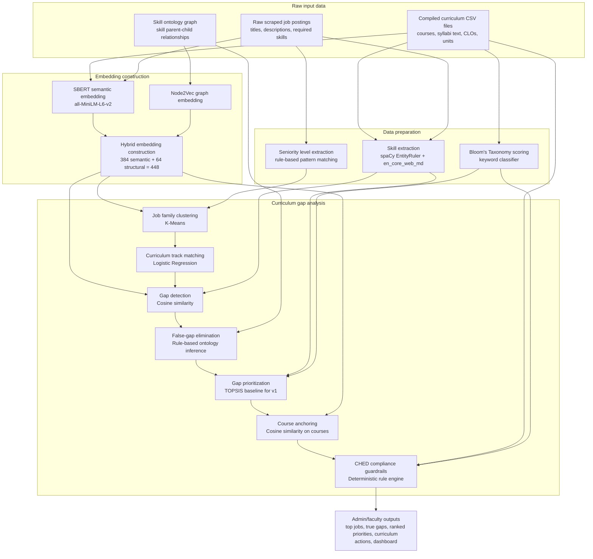
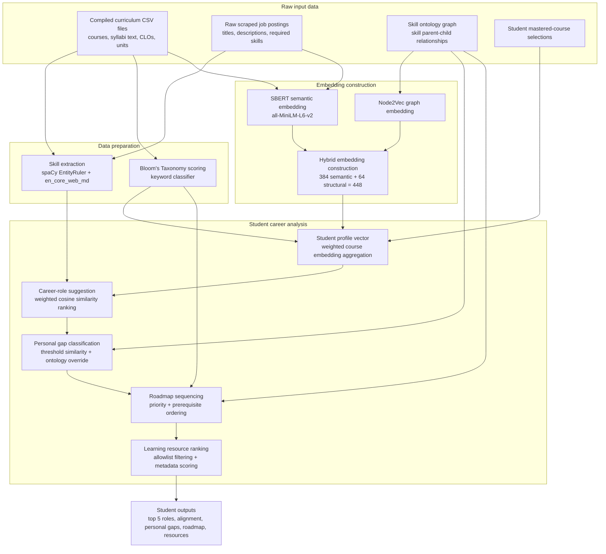

# TechGap Algorithm Process Diagrams

This document uses the same terminology as [ALGORITHMS.md](/C:/Users/Alfierey/Downloads/JR/Programming/VSCode/TechGap/docs/algorithms/ALGORITHMS.md). It separates the pipeline into two diagrams:

- Admin/faculty curriculum analysis
- Student personal analysis

The curriculum input is treated as one source: compiled curriculum CSV files. These CSV files contain the course records, syllabus text, CLOs, units, and curriculum metadata extracted from the original syllabi.

## Admin and Faculty Curriculum Analysis

### Admin and faculty flow explanation

The admin/faculty flow compares the curriculum against industry demand. It starts with compiled curriculum CSV files, raw scraped job postings, and the skill ontology graph.

`Compiled curriculum CSV files` contain the curriculum-side data: courses, syllabus text, CLOs, units, and curriculum metadata. This is the source used to understand what the program currently teaches.

`Raw scraped job postings` contain the industry-side data: job titles, descriptions, listed requirements, and seniority wording. This is the source used to understand what employers currently ask for.

`Skill ontology graph` contains skill relationships. It helps the system understand that some skills are related, broader, narrower, or dependent on each other.

`Skill extraction` reads both curriculum text and job text. It extracts known technical skills using `spaCy EntityRuler + en_core_web_md`, then produces curriculum skill lists, job skill lists, and demand counts.

`Bloom's Taxonomy scoring` reads the curriculum CLOs and course text. It detects verbs such as `Apply`, `Analyze`, and `Create` so the system can estimate how deeply a skill is taught.

`Seniority level extraction` reads the job postings. It detects levels such as Intern, Junior, Mid, Senior, and Lead so job demand can be interpreted by career level.

`SBERT semantic embedding` converts curriculum text and job text into semantic vectors. This lets the system compare meaning even when the exact words are different.

`Node2Vec graph embedding` converts the skill ontology graph into structural vectors. This captures where each skill sits in the skill hierarchy.

`Hybrid embedding construction` combines SBERT semantic vectors and Node2Vec structural vectors into one 448-dimensional vector space. This shared space is used for clustering, similarity, gap detection, and course anchoring.

`Job family clustering` uses K-Means to group scraped job postings into job families. These job families represent common market role groups, such as web development, networking, data engineering, or DevOps.

`Curriculum track matching` uses Logistic Regression to match a curriculum track to the most relevant job family or families. This identifies which job demand profile should be compared with the curriculum.

`Gap detection` uses cosine similarity to compare curriculum coverage against the matched job-family skills. It produces covered skills and possible gaps.

`False-gap elimination` uses the skill ontology graph to check whether a possible gap is actually covered by a related parent or child skill. This reduces false positives before the system ranks the gaps.

`Gap prioritization` ranks the true gaps. For v1, TOPSIS is the deterministic baseline because it can combine industry demand, gap severity, and Bloom level without needing expert-labeled training data.

`Course anchoring` finds where each gap should be addressed. A high course similarity suggests modifying an existing course, medium similarity suggests an elective, and low similarity suggests a new course.

`CHED compliance guardrails` check proposed curriculum actions against deterministic curriculum rules. This protects required courses, unit constraints, outcome mappings, and other compliance requirements.

`Admin/faculty outputs` are the final dashboard and report results: top jobs, supporting evidence, true curriculum gaps, ranked priorities, and suggested curriculum actions.

## Student Personal Analysis

### Student flow explanation

The student flow uses the same curriculum, job, and ontology foundation, but its goal is different. Instead of finding curriculum gaps for faculty, it finds career options and personal gaps for one student.

`Compiled curriculum CSV files` provide course records, syllabus text, CLOs, units, and curriculum metadata. The student flow uses this data to understand what each course teaches.

`Raw scraped job postings` provide the role and skill demand profiles used for career-role suggestions.

`Skill ontology graph` provides skill relationships. It helps the system avoid treating related skills as unrelated during personal gap classification and roadmap sequencing.

`Student mastered-course selections` identify which courses the student has already completed or considers mastered. This is the student-specific input.

`Skill extraction` reads the curriculum and job text. It produces the curriculum skill list and job skill demand list used by the student recommendation flow.

`Bloom's Taxonomy scoring` reads curriculum CLOs and course text. It helps weight mastered courses based on the depth of learning represented in each course.

`SBERT semantic embedding` converts curriculum and job text into semantic vectors so the student profile can be compared with career-role demand profiles.

`Node2Vec graph embedding` converts the skill ontology graph into structural vectors so skill relationships can be included in the same analysis space.

`Hybrid embedding construction` combines semantic and structural vectors into one 448-dimensional hybrid embedding space.

`Student profile vector` converts the student's mastered courses into one vector. Courses can be weighted by units, contact hours, and Bloom depth so stronger or deeper courses contribute more.

`Career-role suggestion` compares the student profile vector against role demand profiles. It ranks roles using similarity, market demand, and supporting job evidence.

`Personal gap classification` compares the student profile with the selected career role. Each required skill is classified as `Present`, `Partial`, `Missing`, or `Future Curriculum Coverage`.

`Roadmap sequencing` turns the student's missing or partial skills into an ordered learning path. It considers both priority and prerequisites.

`Learning resource ranking` attaches trusted learning resources to each roadmap step. It filters resources by allowlisted domains and ranks them using cached metadata.

`Student outputs` are the final student-facing results: top 5 career-role suggestions, personal alignment, personal skill gaps, sequenced roadmap, and recommended resources.
