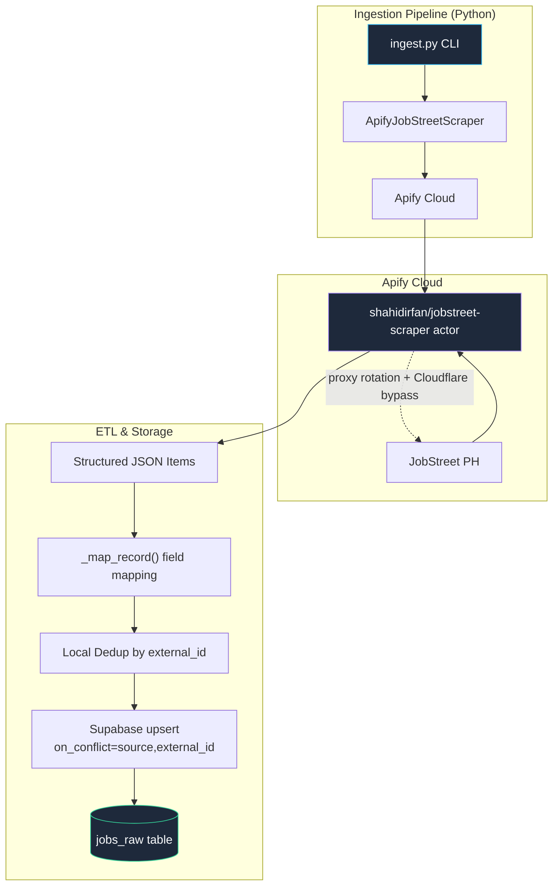

# TechGap — JobStreet Scraping Implementation Plan

> **Last Updated: April 2026**
> **Status: Phases 1–3 COMPLETE. Full-scale run pending.**

## 1. Objective & Scope

Build an **Apify actor-based pipeline** that extracts **Job Market Data** from JobStreet Philippines using the managed `shahidirfan/jobstreet-scraper` Apify actor, maps structured JSON output to the `jobs_raw` Supabase table, and deduplicates entries by the composite key `(source, external_id)`.

> [!IMPORTANT]
> **Architecture pivot (April 2026):** The original plan used a custom Playwright stealth scraper backed by Bright Data proxies. This was replaced with the **Apify managed actor** approach after Bright Data API access issues could not be resolved. The Apify actor natively handles JavaScript rendering, Cloudflare bypass, and proxy rotation — eliminating all custom browser automation complexity.

| PRD Field | Apify Actor Field | `jobs_raw` Column |
|---|---|---|
| **Job Title** | `title` | `job_title` |
| **Contract Type** | `workType` | `contract_type` |
| **Seniority Level** | *(NLP post-processing — Week 2)* | `seniority_level` |
| **Job Description** | `description_text` | `description` |
| **Skill Keywords** | *(NLP post-processing — Week 2)* | *(via `job_skills` junction table)* |
| **Industry Demand Frequency** | *(aggregated across ingestion)* | *(aggregated in Supabase)* |
| **Location / Salary** | `location`, `salary` (string) | `location`, `salary_min`, `salary_max` |

### 1.1 Scraping Scope

| Dimension | Definition |
|---|---|
| **Platform** | JobStreet Philippines via Apify actor `shahidirfan/jobstreet-scraper` |
| **Geography** | Philippines only (`country: "ph"`) |
| **Recency Window** | Jobs posted within the **last 6 months** — records older than 180 days dropped client-side after retrieval |
| **Language** | English only (default for PH IT listings) |
| **Classification** | ICT / Information Technology category only |
| **Contract Types** | All (Full-time, Part-time, Contract, Freelance, Internship) |
| **Tracks Covered** | CS-IS, CS-GD, IT-WD, IT-NT (keyword sets defined in Section 6) |
| **Target Volume** | 5,000 unique postings (minimum); 10,000 stretch goal |
| **Per-Track Minimum** | 300 unique jobs per track; Adzuna API fallback if not met |
| **Deduplication Key** | `(source, external_id)` — Postgres `UNIQUE(source, external_id)` constraint enforced |

### 1.2 Keyword Distribution (Actual — as Configured in `ingest.py`)

Budget: **5,000 total ÷ 20 keywords = 250 jobs per keyword**

| Track | Keywords | Keyword Count | Expected Yield |
|---|---|---|---|
| **IT-WD** | `web developer`, `frontend developer`, `backend developer`, `full stack developer`, `react developer`, `nodejs developer` | 6 | ~1,500 |
| **IT-NT** | `network engineer`, `network administrator`, `systems administrator`, `cybersecurity analyst`, `IT support` | 5 | ~1,250 |
| **CS-IS** | `software engineer`, `software developer`, `data analyst`, `business analyst`, `information systems` | 5 | ~1,250 |
| **CS-GD** | `game developer`, `unity developer`, `UI UX designer`, `graphic designer` | 4 | ~1,000 |
| **Total** | — | **20** | **~5,000 (pre-dedup)** |

> [!IMPORTANT]
> CS-GD (Game Development) is the **high-risk track**. Fewer game dev jobs exist on JobStreet PH. If the per-track minimum of 300 is not met, supplement with the Adzuna API. See Subtask 1.2 for Adzuna configuration.

> [!NOTE]
> The final inserted count will be slightly lower than 5,000 due to cross-keyword deduplication (e.g., a "React Developer" job appearing under both `react developer` and `frontend developer` searches). The pipeline's local deduplication step removes these automatically.

---

## 2. Architecture

### 2.1 System Diagram



### 2.2 Directory Structure (Actual — April 2026)

```
techgap/
├── scraper/
│   ├── __init__.py
│   ├── config.py                    # ✅ Pydantic settings loaded from .env
│   ├── requirements.txt             # ✅ apify-client, supabase, pydantic-settings
│   │
│   ├── client/
│   │   ├── __init__.py
│   │   └── apify_scraper.py         # ✅ ApifyJobStreetScraper — DONE
│   │
│   ├── pipeline/
│   │   ├── __init__.py
│   │   └── ingest.py                # ✅ ETL orchestrator — DONE
│   │
│   └── tests/
│       └── fixtures/
│           └── README.md
│
├── .env                             # Active credentials (not committed to git)
└── .env.example                     # Template for other developers
```

### 2.3 Tech Stack

| Component | Technology | Cost | Status |
|---|---|---|---|
| Actor Platform | **Apify** (`shahidirfan/jobstreet-scraper`) | ~$1/1,000 results; $5 free credit/mo | ✅ Active |
| Python SDK | **apify-client** | Free (OSS) | ✅ Installed |
| Config Management | **pydantic-settings** | Free (OSS) | ✅ Installed |
| Database Client | **supabase** Python SDK | Free (OSS) | ✅ Connected |
| NLP (Week 2) | **spaCy** (`en_core_web_sm`) | Free (OSS) | ⏳ Pending |

---

## 3. Security & Anti-Bot Strategy

All anti-bot complexity is offloaded to the **Apify managed actor**:

| Layer | Security Measure | How It's Handled |
|---|---|---|
| **Network** | Cloudflare WAF, IP Rate Limiting | Apify handles residential proxy rotation automatically |
| **Fingerprint** | Canvas/WebGL, TLS JA3/JA4 | Actor uses browser-grade fingerprints |
| **Behavioral** | Human behavior detection | Actor's headless browser mimics human browsing |
| **Challenges** | Turnstile, Managed Challenges | Auto-solved by Apify infrastructure |
| **Data Extraction** | Next.js hydration, GraphQL Auth | Actor returns structured JSON — no HTML parsing needed |

> [!TIP]
> **Zero Babysitting:** Because Apify manages proxy infrastructure and browser fingerprinting, the script is 100% autonomous. No manual CAPTCHA solving, no proxy management, no IP rotation configuration.

---

## 4. Component Specifications

### 4.1 Configuration (`scraper/config.py`) — ✅ DONE

```python
class ScraperConfig(BaseSettings):
    ACTIVE_PROVIDER: Literal["APIFY", "BRIGHTDATA", "SCRAPERAPI"] = "APIFY"
    APIFY_API_TOKEN: str = ""
    APIFY_ACTOR_ID: str = "shahidirfan/jobstreet-scraper"
    APIFY_COUNTRY: str = "ph"
    APIFY_MAX_ITEMS: int = 5000
    SUPABASE_URL: str = ""
    SUPABASE_KEY: str = ""
    CONCURRENT_REQUESTS: int = 5
    MAX_POST_AGE_DAYS: int = 180

    class Config:
        env_file = ".env"
        env_file_encoding = "utf-8"
```

### 4.2 Apify Scraper Client (`scraper/client/apify_scraper.py`) — ✅ DONE

**Field Mapping (`FIELD_MAP`):**

| Actor Key | `jobs_raw` Column | Notes |
|---|---|---|
| `id` | `external_id` | Primary dedup key |
| `title` | `job_title` | |
| `description_text` | `description` | Plain text, not HTML |
| `workType` | `contract_type` | |
| `company` | `company_name` | Normalized: dict → string |
| `location` | `location` | Normalized: dict → city/area/label |
| `classification` | `classification` | |
| `url` | `source_url` | Direct JobStreet link |
| `postedAt_iso` | `posted_at` | ISO 8601 string |
| *(injected)* | `source` | Always `"jobstreet"` |
| *(injected)* | `raw_json` | Full actor output for audit |
| *(parsed)* | `salary_min`, `salary_max` | Regex-parsed from `salary` string field |

**Key behaviours:**
- Per-keyword cap: `max(10, max_items // len(keywords))` — ensures even distribution
- Actor input: `{ "keyword": kw, "country": "ph", "results_wanted": N, "posted_date": "anytime" }`
- Client-side age filter: drops records where `posted_at` is older than `MAX_POST_AGE_DAYS`
- Graceful per-keyword failure: logs error and continues with next keyword

**Salary parsing (regex):**
```python
nums = re.findall(r'\d+(?:,\d+)*', salary_str)
nums = [float(n.replace(',', '')) for n in nums]
# "₱40,000 – ₱60,000" → salary_min=40000.0, salary_max=60000.0
```

### 4.3 ETL Pipeline (`scraper/pipeline/ingest.py`) — ✅ DONE

**Usage:**
```bash
# 20-job smoke test (uses only first 3 keywords)
python -m scraper.pipeline.ingest --test

# Custom count
python -m scraper.pipeline.ingest --max 500

# Full 5,000-job run (all 20 keywords)
python -m scraper.pipeline.ingest
```

**Pipeline steps:**
1. Load `ScraperConfig` from `.env`
2. Validate `APIFY_API_TOKEN` is set
3. Run `ApifyJobStreetScraper.run()` for all keywords (or first 3 in `--test` mode)
4. **Local deduplication** by `external_id` — prevents Postgres `ON CONFLICT DO UPDATE command cannot affect row a second time` error when the same job appears for multiple keywords
5. Upsert to `jobs_raw` with `on_conflict="source, external_id"` — matches the `UNIQUE(source, external_id)` DB constraint exactly
6. Print ingestion report: scraped count, sent count, saved count, error count, elapsed time

---

## 5. Environment Configuration

### `.env` (Active Setup)

```env
# --- Provider ---
ACTIVE_PROVIDER=APIFY

# --- Apify ---
APIFY_API_TOKEN=<from console.apify.com/account/integrations>
APIFY_ACTOR_ID=shahidirfan/jobstreet-scraper
APIFY_COUNTRY=ph
APIFY_MAX_ITEMS=5000

# --- Supabase ---
SUPABASE_URL=https://rrjpszkadekkfqmiyxfq.supabase.co
# IMPORTANT: Use the legacy JWT anon key (eyJhb...), NOT the sb_publishable_ key.
# supabase-py SDK v2 requires JWT format.
# Get it from: Supabase Dashboard → Project Settings → API → "anon (legacy)"
SUPABASE_KEY=<legacy-jwt-anon-key-starting-with-eyJhb...>

# --- Scraper Behavior ---
CONCURRENT_REQUESTS=5
MAX_POST_AGE_DAYS=180
```

> [!WARNING]
> The `SUPABASE_KEY` **must** be the legacy JWT key (starts with `eyJhb...`), **not** the new publishable key format (`sb_publishable_...`). The `supabase-py` SDK throws `InvalidAPIKey` for the new format.

---

## 6. Search Keywords (Configured in `ingest.py`)

```python
KEYWORDS = [
    # IT-WD track
    "web developer",
    "frontend developer",
    "backend developer",
    "full stack developer",
    "react developer",
    "nodejs developer",
    # IT-NT track
    "network engineer",
    "network administrator",
    "systems administrator",
    "cybersecurity analyst",
    "IT support",
    # CS-IS track
    "software engineer",
    "software developer",
    "data analyst",
    "business analyst",
    "information systems",
    # CS-GD track
    "game developer",
    "unity developer",
    "UI UX designer",
    "graphic designer",
]
```

Distribution: **20 keywords × 250 jobs = 5,000 target** (before local deduplication)

---

## 7. Data Pipeline — ETL to Supabase

### 7.1 Database Constraint (Verified April 2026)

```sql
-- Actual constraint on jobs_raw table:
UNIQUE (source, external_id)
```

The `upsert` call **must** use `on_conflict="source, external_id"` — using `on_conflict="external_id"` alone raises Postgres error `42P10` ("no unique or exclusion constraint matching the ON CONFLICT specification").

### 7.2 Deduplication Strategy (Two Layers)

```
Layer 1 — Local (Python), before upsert:
  • Build dict keyed by external_id → takes last value for each ID
  • Prevents "ON CONFLICT DO UPDATE command cannot affect row a second time"
    when the same job appears across multiple keyword runs in a single batch

Layer 2 — Database (Postgres), at upsert time:
  • UNIQUE(source, external_id) with ON CONFLICT DO UPDATE
  • Ensures idempotent re-runs — re-running ingest.py never creates duplicates
  • Updates existing row metadata if the job was refreshed on JobStreet
```

### 7.3 Full Field Mapping to `jobs_raw`

| Actor Output Field | `jobs_raw` Column | Set By | Notes |
|---|---|---|---|
| `id` | `external_id` | `_map_record()` | Primary dedup key |
| `title` | `job_title` | `_map_record()` | |
| `description_text` | `description` | `_map_record()` | Plain text from actor |
| `workType` | `contract_type` | `_map_record()` | |
| `location` (dict/str) | `location` | `_map_record()` | Normalized to string |
| `salary` (str) | `salary_min`, `salary_max` | `_map_record()` | Regex-parsed |
| — | `salary_currency` | `_map_record()` | Hardcoded `'PHP'` |
| `company` (dict/str) | `company_name` | `_map_record()` | Normalized to string |
| `classification` | `classification` | `_map_record()` | |
| `postedAt_iso` | `posted_at` | `_map_record()` | ISO 8601; rejected if >180d |
| Full item dict | `raw_json` | `_map_record()` | Full actor output for audit |
| `url` | `source_url` | `_map_record()` | Direct JobStreet link |
| — | `source` | `_map_record()` | Always `'jobstreet'` |
| — | `scraped_at` | Supabase default | `NOW()` |
| — | `seniority_level` | NLP (Week 2) | `NULL` until populated |
| — | `track_alignment` | NLP (Week 2) | `NULL` until populated |
| — | `description_embedding` | SBERT (Week 3) | `NULL` until computed |

---

## 8. Phased Implementation Status

| Phase | Deliverables | Status |
|---|---|---|
| **Phase 1: Apify Setup** | Identify actor, configure `.env`, run debug test, inspect raw output | ✅ **COMPLETE** |
| **Phase 2: Supabase ETL** | `ApifyJobStreetScraper`, `ingest.py`, field mapping, salary parsing, dedup fix | ✅ **COMPLETE** |
| **Phase 3: Smoke Test** | `--test` mode: 20 jobs, 0 errors, 18.8s elapsed; rows verified in Table Editor | ✅ **COMPLETE** |
| **Phase 4: Full-Scale Run** | `python -m scraper.pipeline.ingest` — 5,000 jobs across all 20 keywords | ⏳ **NEXT** |
| **Phase 5: NLP Pipeline** | Seniority extraction, skill keyword extraction, `track_alignment` assignment | ⏳ Week 2 |
| **Phase 6: Validation** | Spot-check 20 rows, validate deduplication, confirm `posted_at` spread | ⏳ Pending |

---

## 9. NLP Post-Processing (Week 2 — Pending)

These populate `NULL` columns in `jobs_raw` after the full data collection run.

### Seniority Extraction (`nlp/seniority.py`)

```python
SENIORITY_PATTERNS = {
    "Intern":   [r"\bintern\b", r"\binternship\b", r"\bOJT\b"],
    "Junior":   [r"\bjunior\b", r"\bjr\.?\b", r"\bentry[- ]level\b", r"\bfresh\s?grad\b"],
    "Mid":      [r"\bmid[- ]level\b", r"\b[2-4]\+?\s*years?\b"],
    "Senior":   [r"\bsenior\b", r"\bsr\.?\b", r"\b[5-9]\+?\s*years?\b"],
    "Lead":     [r"\blead\b", r"\bprincipal\b", r"\bstaff\b", r"\barchitect\b"],
    "Manager":  [r"\bmanager\b", r"\bdirector\b", r"\bvp\b", r"\bchief\b"],
}
```

### Skill Extraction (`nlp/skills.py`)

A curated `TECH_SKILLS` set (~100+ terms) covers languages, frameworks, data/ML tools, DevOps, and practices. Matched against `description` text using case-insensitive substring search.

### Track Alignment Assignment

After seniority and skill extraction, each job's `track_alignment` is assigned (`CS-IS`, `CS-GD`, `IT-WD`, `IT-NT`) based on the keyword used during ingestion or via a trained Logistic Regression classifier in Week 3.

---

## 10. Error Handling & Resilience

Per-keyword failure isolation in `ApifyJobStreetScraper.run()`:

```python
for keyword in keywords:
    try:
        raw_items = self._run_actor(keyword, country, per_keyword)
    except Exception as exc:
        logger.error(f"Actor run failed for '{keyword}': {exc}")
        continue  # Skip failed keyword, don't abort entire run
```

If an actor run ends with status ≠ `SUCCEEDED`, a `RuntimeError` is raised with a direct link to the Apify console run page for debugging. The orchestrator skips the failed keyword and continues.

---

## 11. Verification Plan

### Completed
- ✅ **Smoke test**: `python -m scraper.pipeline.ingest --test` — 20 jobs, 0 errors, 18.8s
- ✅ **Constraint fix**: upsert uses `on_conflict="source, external_id"` matching actual DB constraint
- ✅ **Auth fix**: Supabase connected with legacy JWT anon key

### Pending (after full run)
- Run `ingest.py --test` twice — confirm row count does **not** increase on second run
- Open Supabase Table Editor → `jobs_raw` → confirm rows with `source='jobstreet'`
- Spot-check 5 rows: compare `source_url`, `job_title`, `description` against live JobStreet listing
- Verify all `posted_at` values are within the last 180 days
- Run full 5,000-job batch and check Apify credit usage (target: ≤ $5)

---

## 12. Resolved Decisions

| Decision | Resolution |
|---|---|
| **Bright Data vs. Apify** | **Apify** chosen — Bright Data API access issues could not be resolved. Apify natively supports JobStreet with $5 free monthly credit. |
| **Custom Playwright vs. Managed Actor** | **Managed Actor** — eliminates browser fingerprinting, proxy management, and Cloudflare bypass complexity entirely |
| **Deduplication Key** | `UNIQUE(source, external_id)` composite constraint — not just `external_id` alone (discovered and fixed April 2026) |
| **Supabase Key Format** | Must use legacy JWT anon key (`eyJhb...`), not the new `sb_publishable_` format — SDK requires JWT |
| **Adzuna as Primary Source** | **No** — Adzuna is a supplementary fallback only (Subtask 1.2). Apify/JobStreet is primary. |
| **Indeed Scraper** | **Skipped** — rely on Adzuna API + JobStreet via Apify only |
| **Legal Use** | Confirmed — **academic research only** (TechGap thesis) |
| **Estimated Cost** | ~$5 Apify credit for 5,000 jobs ($1/1,000 results) |

---

## 13. Why Apify Over Direct Playwright/Bright Data

| Factor | Apify (Current) | Bright Data + Playwright (Original Plan) |
|---|---|---|
| **Setup Time** | Minutes (API key + actor call) | Days (proxy config, browser hardening) |
| **Reliability** | Community-maintained actor, tested against live JobStreet | Custom scrapers break with every site re-deployment |
| **Anti-Bot** | Fully managed (Cloudflare, fingerprinting, proxies) | Required manual configuration and debugging |
| **Cost** | $5 free credit (~5,000 jobs) | $0 after trial, but trial API access was broken |
| **Maintenance** | Zero — actor updates handle site changes | High — any DOM/API change breaks the parser |
| **Output Quality** | Structured JSON — no HTML parsing needed | Returned raw HTML requiring BeautifulSoup parsing |

---

## 14. Legal Notice

> [!WARNING]
> This scraper is designed and approved for **academic research purposes only** as part of the TechGap thesis project. The extracted data:
> - Must **not** be redistributed commercially
> - Must **not** be used to build competing job platforms
> - Should be **aggregated and anonymized** in final thesis outputs
> - Falls under **fair use for academic research** at the planned volume

---

**Phase 1–3 complete. Next action: run full-scale collection with `python -m scraper.pipeline.ingest`.**
