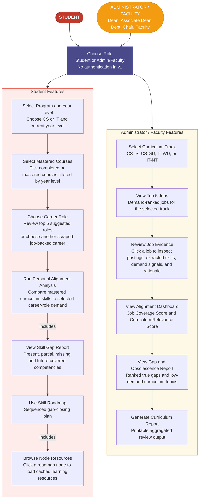
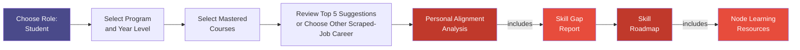
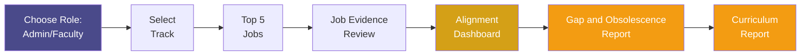

# TechGap - Use Case Documentation

> **Last Updated:** 2026-05-13
> **Based on:** Revised v1 user flow for Student and Administrator/Faculty actors

---

## 1. Actors

| Actor | Description |
|---|---|
| **Student** | A CICS student who uses TechGap to describe their academic progress, choose or receive career-role guidance, measure personal curriculum-industry alignment, identify skill gaps, and follow a sequenced learning roadmap. |
| **Administrator / Faculty** | Includes the Dean, Associate Dean, Department Chairs, and faculty members. Uses TechGap to evaluate a selected curriculum track against industry demand, inspect job evidence, and generate PRD-defined reports for curriculum planning. |

> **Shared Entry Point:** TechGap v1 starts with **Choose Role**. Authentication, account registration, and RBAC are intentionally deferred. Inputs are session/demo scoped unless persistence is added later.

---

## 2. Full Use Case Diagram

---

## 3. Student Workflow

### 3.1 Narrative

The TechGap system recognizes two primary actors: the **Student** and the **Administrator/Faculty**. The Student uses the platform to examine personal curriculum-to-career alignment and receive guided role-based recommendations, while the Administrator/Faculty actor uses the platform to evaluate curriculum-track performance against industry demand and generate report-centered outputs for academic review. In the current v1 scope, both actors begin from a shared **Choose Role** entry point. Authentication, account registration, and role-based access control are intentionally deferred, allowing the core student and administrative journeys to proceed without identity infrastructure as a prerequisite.

The Student begins the workflow by selecting the **Student** role from the shared entry screen. The system then collects the student's academic context by asking for the program and year level, followed by the set of completed or confidently mastered courses drawn from the filtered curriculum list. These inputs establish the student's baseline profile for analysis. Based on this profile, the system returns the top five curated career-role suggestions as recommended analysis targets. If the student's intended career is not included in the top five, the student may choose another available career option, provided that the option exists within the scraped job dataset and has supporting job evidence. TechGap then computes and displays a personal alignment score that reflects the relationship between the student's mastered coursework and the selected role's demand profile. Alongside this score, the student views a skill gap report classifying competencies as **Present**, **Partial**, **Missing**, or **Future Curriculum Coverage**. This output directly supports the next use case, where the student accesses a sequenced skill roadmap for closing priority gaps. From each roadmap node, the student may open cached trusted learning resources related to that specific skill, enabling a practical follow-through path from analysis to self-directed improvement.

1. **Select Program and Year Level** - The student chooses CS or IT and their current year level. This scopes the curriculum courses and prevents students from selecting irrelevant course sets.
2. **Select Mastered Courses** - The student selects completed or mastered courses from the year-level-filtered curriculum list. These courses form the student's personal academic baseline.
3. **Choose Career Role** - The student reviews the top 5 suggested career roles generated from the mastered-course profile and selects one role for analysis, or chooses another career option that exists within the scraped job dataset.
4. **Run Personal Alignment Analysis** - The system compares the student's mastered-course skills against the selected role's demand-weighted job skills.
5. **View Skill Gap Report** *(includes)* - The analysis produces a categorized report of **Present**, **Partial**, **Missing**, and **Future Curriculum Coverage** competencies.
6. **Use Skill Roadmap** - The student receives a sequenced plan for closing priority skill gaps.
7. **Browse Node Resources** *(includes)* - Learning resources are loaded when the student clicks a roadmap node, keeping the first analysis view fast while still giving each skill a practical next step.

### 3.2 Dependency Map

### 3.3 Use Case Specifications

| # | Use Case | Actor | Trigger | Output |
|---|---|---|---|---|
| UC-S1 | Select Program and Year Level | Student | User chooses Student role | Program/year context for filtering curriculum courses |
| UC-S2 | Select Mastered Courses | Student | Program/year context is available | Personal mastered-course baseline |
| UC-S3 | Choose Career Role | Student | Mastered courses are selected | Selected target career role from the top 5 suggestions or another scraped-job-backed career option |
| UC-S4 | Run Personal Alignment Analysis | Student | Career role is selected | Personal alignment score and computed skill coverage |
| UC-S5 | View Skill Gap Report | Student | Auto-triggered by UC-S4 *(includes)* | Competency list categorized as Present, Partial, Missing, or Future Curriculum Coverage |
| UC-S6 | Use Skill Roadmap | Student | Gap report is available | Sequenced gap-closing roadmap |
| UC-S7 | Browse Node Resources | Student | User clicks a roadmap node *(includes)* | Cached trusted learning resources for the selected skill |

---

## 4. Administrator / Faculty Workflow

### 4.1 Narrative

The Administrator/Faculty actor begins the workflow by selecting **Admin/Faculty** from the shared **Choose Role** screen. Similar to the student flow, no login step is required in v1. Rather than uploading syllabi or editing curriculum data directly, the user works from preloaded curriculum-track data and the available job-market evidence prepared for analysis. The journey starts with the selection of a curriculum track, after which the system presents the top five relevant jobs associated with that track. The user may then inspect the supporting job evidence, including the extracted skills and rationale behind the association. Building on this context, TechGap presents an alignment dashboard summarizing curriculum performance through track-level metrics, followed by a gap and obsolescence report that distinguishes high-priority market gaps from low-demand or aging curriculum topics. The workflow concludes with a generated curriculum report that consolidates the dashboard findings, evidence summaries, and recommendation outputs into a printable review artifact for academic planning.

1. **Select Curriculum Track** - The user chooses one track: **CS-IS**, **CS-GD**, **IT-WD**, or **IT-NT**.
2. **View Top 5 Jobs** - TechGap shows the five most relevant demand-ranked jobs for the selected track.
3. **Review Job Evidence** - The user clicks a job to inspect supporting evidence: source postings, extracted skills, demand signals, and the rationale for why the job is associated with the track.
4. **View Alignment Dashboard** - The dashboard summarizes full-track performance through institutional metrics, primarily **Job Coverage Score** and **Curriculum Relevance Score**.
5. **View Gap and Obsolescence Report** - The user reviews ranked true gaps and low-demand curriculum topics generated by the pipeline.
6. **Generate Curriculum Report** - The user views the aggregated report outputs for planning and review. This is the terminal v1 admin output and does not depend on a separate simulation step.

### 4.2 Dependency Map

### 4.3 Use Case Specifications

| # | Use Case | Actor | Trigger | Output |
|---|---|---|---|---|
| UC-A1 | Select Curriculum Track | Admin/Faculty | User chooses Admin/Faculty role | Track filter applied to curriculum and job-market analysis |
| UC-A2 | View Top 5 Jobs | Admin/Faculty | Track is selected | Five demand-ranked jobs for the selected track |
| UC-A3 | Review Job Evidence | Admin/Faculty | User clicks a job | Evidence panel with postings, extracted skills, demand signals, and rationale |
| UC-A4 | View Alignment Dashboard | Admin/Faculty | Track/job evidence context is available | Job Coverage Score, Curriculum Relevance Score, and supporting dashboard metrics |
| UC-A5 | View Gap and Obsolescence Report | Admin/Faculty | Dashboard is loaded | Ranked true gaps and low-demand topic flags |
| UC-A6 | Generate Curriculum Report | Admin/Faculty | Reports are available | PRD-defined curriculum recommendations and CHED guardrail summary |

---

## 5. Includes Relationship Summary

> An **includes** relationship means the included use case is always triggered as a mandatory part of its base use case.

| Base Use Case | Included Use Case | Reason |
|---|---|---|
| Run Personal Alignment Analysis (UC-S4) | View Skill Gap Report (UC-S5) | The gap report is generated as part of computing personal alignment. |
| Use Skill Roadmap (UC-S6) | Browse Node Resources (UC-S7) | Roadmap nodes expose learning resources on click; resources are not a separate top-level flow. |

---

## 6. Shared Use Case: Choose Role

| Field | Detail |
|---|---|
| **Actors** | Student, Administrator/Faculty |
| **Trigger** | Any actor opens the TechGap platform |
| **Precondition** | None. This is the v1 entry point. |
| **Flow** | 1. Actor opens TechGap. 2. System shows role choices: Student or Admin/Faculty. 3. Actor chooses a role. 4. System routes the actor to the role-specific flow. |
| **Output** | Session-scoped role selection and access to the Student flow or Admin/Faculty flow |
| **Failure** | If no role is selected, the system remains on the role selector. |

---

## 7. Data Source Notes

| Area | v1 Source |
|---|---|
| Curriculum data | Preloaded structured curriculum CSVs for CS-IS, CS-GD, IT-WD, and IT-NT. Syllabus upload is not a user-facing v1 use case. |
| Job data | Existing collected or seeded job postings and extracted job skills. Also bounds the student's alternate career-role choices when the target is outside the top 5 suggestions. |
| Student data | Session/demo-scoped program, year level, mastered-course selection, and selected career role from either the top 5 suggestions or the scraped-job-backed option list. |
| Learning resources | Cached trusted resource catalog shown lazily when a roadmap node is clicked. |

---

*This document represents the revised v1 functional scope of TechGap. For technical implementation details, refer to [PRD.md](./PRD.md), [PRD_Detailed.md](./PRD_Detailed.md), [Model.md](./Model.md), and [technical_plan_status.md](./technical_plan_status.md).*
