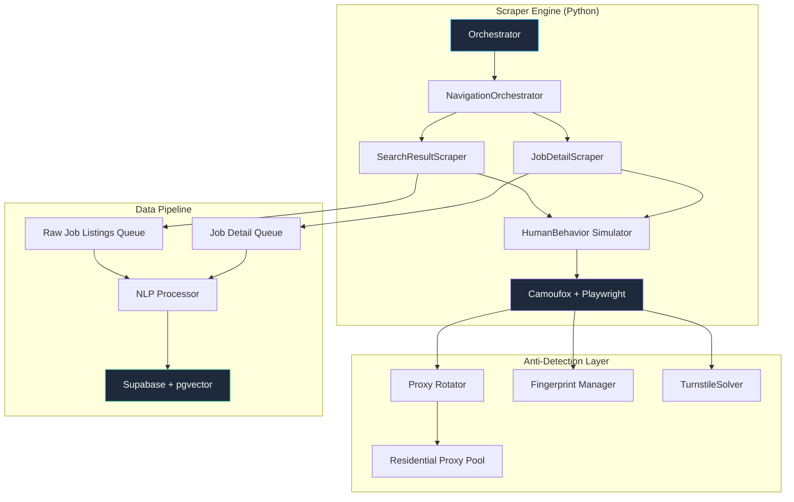

# TechGap — JobStreet Web Scraping Implementation Plan

## 1. Objective & Scope

Build a **stealth Playwright scraper** that extracts **Job Market Data** from JobStreet Philippines (`ph.jobstreet.com`) as defined in the [TechGap PRD](file:///c:/Users/Alfierey/Downloads/JR/Programming/VSCode/TechGap/TechGap%20PRD.md), Section 1.B:

| PRD Field | Source on JobStreet | Extraction Method |
|---|---|---|
| **Job Title** | Search results + detail page | DOM `data-automation="jobTitle"` / `__NEXT_DATA__` |
| **Contract Type** | Detail page sidebar | `__NEXT_DATA__` → `workType` |
| **Seniority Level** | Parsed from title + description via NLP | Post-processing (regex + spaCy) |
| **Job Description** | Detail page body | `__NEXT_DATA__` → `description` (HTML) |
| **Skill Keywords** | Extracted from description | Post-processing (NER + keyword list) |
| **Industry Demand Frequency** | Aggregated across all scraped postings | ETL aggregation in Supabase |
| **Location / Salary** | Detail page metadata | `__NEXT_DATA__` → `location`, `salary` |

---

## 2. JobStreet Technical Reconnaissance

### 2.1 Platform Architecture

JobStreet (owned by SEEK) runs a **Next.js** frontend backed by an **internal GraphQL API**. Key characteristics:

- **Server-Side Rendering (SSR):** Pages are pre-rendered server-side. The full dataset for a page is embedded in a `<script id="__NEXT_DATA__" type="application/json">` tag.
- **Client-Side Hydration:** Next.js hydrates the SSR HTML with the `__NEXT_DATA__` JSON. This means **all job data is available in raw JSON before any JS executes on the client**.
- **GraphQL Backend:** Network requests go to a `/graphql` endpoint as `POST` requests. These carry session tokens, build IDs, and query variables.
- **CDN / Edge:** Cloudflare sits in front of SEEK's infrastructure, handling WAF, bot detection, and challenge pages.

### 2.2 URL Patterns (Philippines)

```
# Search results (page N for keyword "software developer")
https://www.jobstreet.com.ph/software-developer-jobs?page=N

# Individual job detail
https://www.jobstreet.com.ph/job/XXXXXXXX  (numeric job ID)

# Alternative search pattern with classification
https://www.jobstreet.com.ph/jobs-in-information-technology?page=N
```

> [!IMPORTANT]
> JobStreet uses **client-side routing** for pagination. The URL may update via `history.pushState` without a full page reload. The scraper must wait for the DOM/network to settle after navigation.

### 2.3 DOM Structure & Data Selectors

#### Search Results Page

```html
<!-- Job card container -->
<article data-testid="job-card" data-job-id="XXXXXXXX">
  <a data-automation="jobTitle" href="/job/XXXXXXXX">
    <h3>Full Stack Developer</h3>
  </a>
  <span data-automation="jobCompany">TechCorp Inc.</span>
  <span data-automation="jobLocation">Makati, Metro Manila</span>
  <span data-automation="jobSalary">₱40,000 – ₱60,000 per month</span>
  <span data-automation="jobListingDate">2d ago</span>
  <ul data-automation="jobClassification">
    <li>Information Technology</li>
  </ul>
</article>
```

#### Job Detail Page (`__NEXT_DATA__` schema — key paths)

```jsonc
{
  "props": {
    "pageProps": {
      "jobDetail": {
        "id": "XXXXXXXX",
        "title": "Full Stack Developer",
        "description": "<p>We are looking for...</p>", // HTML
        "company": {
          "name": "TechCorp Inc.",
          "id": "YYYYYY"
        },
        "location": {
          "label": "Makati, Metro Manila",
          "countryCode": "PH"
        },
        "salary": {
          "label": "₱40,000 – ₱60,000 per month",
          "min": 40000,
          "max": 60000,
          "currency": "PHP",
          "frequency": "monthly"
        },
        "workType": "Full-time",       // Maps to PRD "Contract Type"
        "classifications": [
          { "description": "Information Technology" }
        ],
        "postedAt": "2026-04-02T00:00:00Z",
        "expiresAt": "2026-05-02T00:00:00Z"
      }
    }
  },
  "buildId": "abc123..."
}
```

> [!NOTE]
> The `__NEXT_DATA__` path (`props.pageProps.jobDetail`) may change between deployments. The scraper should include a **fallback discovery mechanism** that searches the JSON tree for known keys (`title`, `description`, `workType`) if the expected path is not found.

---

## 3. Security Countermeasure Bypass Matrix

Each of the 16 identified security measures is addressed below with a specific counterstrategy:

### Layer 1: Network-Level Defenses (Free — No Paid Proxies)

| # | Security Measure | Bypass Strategy | Implementation |
|---|---|---|---|
| 1 | **Cloudflare WAF** | **Your home ISP IP is already a residential IP.** Avoid WAF triggers by limiting request velocity (~3-5 requests/min) and using natural browsing patterns | Aggressive rate limiting via `HumanBehavior` delays |
| 4 | **IP-Based Rate Limiting** | **No proxy rotation needed at low volume.** Implement adaptive exponential backoff on 429/403 responses. If blocked, pause the session for 30-60 minutes (your IP will be unblocked) | Exponential backoff + long cooldown on detection |
| 8 | **User-Agent & Header Consistency** | Lock each browser context to a consistent fingerprint (UA, `Sec-CH-UA`, `Accept-Language`, etc.) | Fingerprint profiles stored as JSON configs |
| 15 | **CORS Policies** | Not applicable — Playwright operates in a full browser context, not cross-origin XHR | N/A (only affects API-direct approaches) |

> [!TIP]
> **Why no paid proxies?** Your home internet connection is already a residential IP (from your ISP like PLDT, Globe, Converge). At the planned volume of ~250 jobs/day across 5 short sessions, a single residential IP is sufficient. Cloudflare primarily flags **datacenter IPs** (AWS, DigitalOcean, etc.) — your home IP won't trigger that heuristic.

### Layer 2: Browser Fingerprinting

| # | Security Measure | Bypass Strategy | Implementation |
|---|---|---|---|
| 5 | **Canvas & WebGL Fingerprinting** | Use **Camoufox** (Firefox-based anti-detect) which modifies canvas/WebGL output at the C++ engine level instead of JS patching | Camoufox binary + Playwright connector |
| 6 | **`navigator.webdriver` Flag** | Camoufox removes `webdriver` flag at engine level; additionally, stealth plugin injects overrides earlier in page lifecycle | Camoufox + `playwright-extra` stealth |
| 7 | **JA3/JA4 TLS Fingerprinting** | Camoufox uses Firefox's native TLS stack (not Chromium), producing a genuine Firefox JA3 hash that does not match known automation tools | Camoufox (inherent) |

### Layer 3: Behavioral Detection

| # | Security Measure | Bypass Strategy | Implementation |
|---|---|---|---|
| 9 | **Behavioral Biometrics** | Simulate human mouse movements (Bézier curves), random scroll patterns, and keypress timing | Custom `HumanBehavior` class |
| 10 | **Navigation Path Analysis** | Start from homepage → search → filter → paginate (never jump directly to page 47) | `NavigationOrchestrator` state machine |
| 14 | **Honey Pot Links** | Never click `<a>` tags with `display:none`, `visibility:hidden`, `opacity:0`, or `position: absolute; left:-9999px` | CSS property filter before any click |

### Layer 4: Challenge Systems (Free — No Paid CAPTCHA Solvers)

| # | Security Measure | Bypass Strategy | Implementation |
|---|---|---|---|
| 2 | **Cloudflare Turnstile / Managed Challenges** | **Primary:** Persistent browser contexts with cookie reuse — solve one challenge manually at session start, reuse cookies for entire session. **Fallback:** Pause and prompt the operator to solve manually (since we run headed mode). No paid solver needed. | `ChallengeHandler` class with cookie persistence + manual-solve prompt |
| 3 | **JS Challenges** | Camoufox executes JS challenges natively (not headless Chromium); pass through naturally | Camoufox (inherent capability) |

> [!NOTE]
> **Why manual solving works:** Since the scraper runs on your own machine in **headed mode** (visible browser window), you can simply solve any Turnstile challenge that appears — click the checkbox, complete the puzzle, and the scraper continues. Cookies persist for hours, so you typically solve once per session at most.

### Layer 5: API & Application-Level

| # | Security Measure | Bypass Strategy | Implementation |
|---|---|---|---|
| 11 | **GraphQL Auth & Session Tokens** | **Do NOT call GraphQL API directly.** Extract data from `__NEXT_DATA__` in the rendered HTML. This avoids needing API tokens entirely. | HTML-first extraction strategy |
| 12 | **Query Complexity Limiting** | Not applicable — we never send direct GraphQL queries | N/A |
| 13 | **Next.js Hydration Monitoring** | Do not interfere with hydration. Let the page fully load and hydrate. Extract `__NEXT_DATA__` after `DOMContentLoaded` before React mounts, or after full hydration settles. | Wait for `networkidle` + extract from `<script>` tag |
| 16 | **CSP Enforcement** | Not applicable — Playwright runs in the page's own origin context. No cross-origin script injection needed. | N/A |

---

## 4. Architecture

### 4.1 System Diagram



### 4.2 Directory Structure

```
techgap/
├── scraper/
│   ├── __init__.py
│   ├── config.py                  # Env vars, proxy config, delays
│   ├── main.py                    # Entry point
│   ├── orchestrator.py            # Job queue + retry logic
│   │
│   ├── browser/
│   │   ├── __init__.py
│   │   ├── engine.py              # Camoufox/Playwright setup
│   │   ├── fingerprint.py         # Browser fingerprint profiles
│   │   ├── proxy.py               # Proxy rotation + health checks
│   │   └── turnstile.py           # Turnstile/challenge solver
│   │
│   ├── navigation/
│   │   ├── __init__.py
│   │   ├── human_behavior.py      # Mouse, scroll, timing simulation
│   │   ├── navigator.py           # State machine for page flow
│   │   └── honeypot_filter.py     # Detects and avoids hidden links
│   │
│   ├── extraction/
│   │   ├── __init__.py
│   │   ├── search_page.py         # Parse search result cards
│   │   ├── detail_page.py         # Parse __NEXT_DATA__ JSON
│   │   ├── next_data_parser.py    # Robust NEXT_DATA extraction
│   │   └── schema.py              # Pydantic models for job data
│   │
│   ├── nlp/
│   │   ├── __init__.py
│   │   ├── seniority.py           # Extract seniority from title/desc
│   │   ├── skills.py              # Skill keyword extraction (NER)
│   │   └── description_cleaner.py # Strip HTML, normalize text
│   │
│   └── pipeline/
│       ├── __init__.py
│       ├── queue.py               # Async job queue (asyncio)
│       ├── deduplication.py       # Job ID-based dedup
│       └── supabase_loader.py     # Upsert to Supabase
│
├── tests/
│   ├── test_extraction.py
│   ├── test_nlp.py
│   ├── test_navigation.py
│   └── fixtures/                  # Saved HTML/JSON snapshots
│
├── profiles/                      # Browser fingerprint configs
│   ├── windows_chrome_125.json
│   ├── macos_firefox_126.json
│   └── linux_firefox_127.json
│
├── requirements.txt
└── .env.example
```

### 4.3 Tech Stack (100% Free)

| Component | Technology | Cost | Rationale |
|---|---|---|---|
| Browser Automation | **Playwright** (Python) + **Camoufox** | Free (OSS) | Camoufox modifies Firefox at C++ level for undetectable fingerprints; Playwright provides robust async API |
| Anti-Detect | **Camoufox** | Free (OSS) | Engine-level `webdriver` removal, TLS normalization, canvas/WebGL spoofing |
| Proxy | **Your home ISP IP** | Free | Already residential — no datacenter flag. Rate-limit to avoid detection |
| CAPTCHA Handling | **Manual solve + cookie persistence** | Free | Headed mode — solve once manually per session, reuse cookies |
| Data Modeling | **Pydantic v2** | Free (OSS) | Strict validation of scraped data before database insertion |
| NLP | **spaCy** (`en_core_web_sm`) + custom regex | Free (OSS) | Seniority extraction, skill keyword extraction, description cleaning |
| Queue | **asyncio.Queue** | Free (stdlib) | Lightweight async queue for scrape → process → load pipeline |
| Database | **Supabase** (PostgreSQL + pgvector) | Free tier | 500MB storage, more than enough. As specified in PRD Section 2.B |
| Configuration | **python-dotenv** + **Pydantic Settings** | Free (OSS) | Secure env-based config |

---

## 5. Detailed Component Specifications

### 5.1 Browser Engine (`browser/engine.py`)

```python
# Pseudocode — production implementation (FREE — no paid services)
import asyncio
from camoufox.async_api import AsyncCamoufox
from playwright.async_api import Page, BrowserContext
from pathlib import Path

class BrowserEngine:
    """Manages Camoufox browser lifecycle with anti-detection.
    Uses your own home IP — no paid proxies needed."""

    def __init__(self, config: ScraperConfig):
        self.config = config
        self.fingerprint_mgr = FingerprintManager()
        self.session_state_path = Path("state/session.json")

    async def create_context(self) -> BrowserContext:
        fingerprint = self.fingerprint_mgr.get_profile()  # Consistent profile

        browser = await AsyncCamoufox(
            headless=False,       # MUST be headed — for manual challenge solving
            humanize=True,        # Enable built-in human mouse/typing simulation
            os="windows",         # Match your actual OS
        )

        context = await browser.new_context(
            locale="en-PH",
            timezone_id="Asia/Manila",
            viewport={"width": 1920, "height": 1080},
            # Persist cookies across sessions (key for Turnstile bypass):
            storage_state=str(self.session_state_path)
                if self.session_state_path.exists() else None,
        )

        return context

    async def save_session(self, context: BrowserContext):
        """Save cookies/localStorage so next session reuses them."""
        self.session_state_path.parent.mkdir(parents=True, exist_ok=True)
        await context.storage_state(path=str(self.session_state_path))

    async def safe_navigate(self, page: Page, url: str):
        """Navigate with challenge detection and manual-solve fallback."""
        await page.goto(url, wait_until="networkidle", timeout=30000)

        # Detect Cloudflare challenge page
        if await self._is_challenge_page(page):
            await self._wait_for_manual_solve(page)
            # Re-navigate after solving
            await page.goto(url, wait_until="networkidle", timeout=30000)

    async def _is_challenge_page(self, page: Page) -> bool:
        return await page.locator(
            "#challenge-running, #cf-challenge-running, .cf-turnstile"
        ).count() > 0

    async def _wait_for_manual_solve(self, page: Page):
        """Pause and wait for the operator to solve the challenge manually.
        Since we run in headed mode, the user sees the challenge and clicks it."""
        print("\n⚠️  CHALLENGE DETECTED — Please solve it in the browser window.")
        print("   Waiting for up to 120 seconds...\n")

        # Wait until the challenge element disappears (= solved)
        try:
            await page.wait_for_selector(
                "#challenge-running, #cf-challenge-running, .cf-turnstile",
                state="detached",
                timeout=120000  # 2 minutes to solve manually
            )
            print("✅  Challenge solved! Continuing...\n")
            # Save cookies immediately so we don't need to solve again
            await self.save_session(page.context)
        except TimeoutError:
            print("❌  Challenge not solved in time. Retrying...\n")
            raise CloudflareBlockError("Manual challenge solve timed out")
```

### 5.2 Human Behavior Simulator (`navigation/human_behavior.py`)

```python
import random
import math
from playwright.async_api import Page

class HumanBehavior:
    """Simulates realistic human interaction patterns."""

    @staticmethod
    async def random_delay(min_s: float = 1.0, max_s: float = 3.5):
        """Non-uniform delay — weighted toward the middle of the range."""
        delay = random.triangular(min_s, max_s, (min_s + max_s) / 2)
        await asyncio.sleep(delay)

    @staticmethod
    async def smooth_scroll(page: Page, distance: int = 300):
        """Scroll with acceleration/deceleration like a human."""
        steps = random.randint(5, 12)
        for i in range(steps):
            # Ease-in-out curve
            t = i / steps
            ease = t * t * (3 - 2 * t)  # Smoothstep
            delta = int(distance / steps * ease * 2)
            await page.mouse.wheel(0, delta)
            await asyncio.sleep(random.uniform(0.02, 0.08))

    @staticmethod
    async def bezier_mouse_move(page: Page, target_x: int, target_y: int):
        """Move mouse along a Bézier curve instead of a straight line."""
        # Get current position (approximate from viewport center)
        start_x, start_y = random.randint(100, 500), random.randint(100, 400)

        # Random control points for natural curvature
        cp1_x = start_x + random.randint(-50, 50)
        cp1_y = (start_y + target_y) // 2 + random.randint(-100, 100)
        cp2_x = target_x + random.randint(-50, 50)
        cp2_y = (start_y + target_y) // 2 + random.randint(-100, 100)

        steps = random.randint(20, 40)
        for i in range(steps + 1):
            t = i / steps
            # Cubic Bézier formula
            x = int((1-t)**3 * start_x + 3*(1-t)**2*t * cp1_x +
                     3*(1-t)*t**2 * cp2_x + t**3 * target_x)
            y = int((1-t)**3 * start_y + 3*(1-t)**2*t * cp1_y +
                     3*(1-t)*t**2 * cp2_y + t**3 * target_y)
            await page.mouse.move(x, y)
            await asyncio.sleep(random.uniform(0.005, 0.025))

    @staticmethod
    async def human_click(page: Page, selector: str):
        """Click with mouse movement + slight offset to avoid pixel-perfect clicks."""
        element = page.locator(selector)
        box = await element.bounding_box()
        if box:
            # Click slightly off-center (humans never click dead center)
            offset_x = random.gauss(0, box["width"] * 0.15)
            offset_y = random.gauss(0, box["height"] * 0.15)
            target_x = int(box["x"] + box["width"] / 2 + offset_x)
            target_y = int(box["y"] + box["height"] / 2 + offset_y)

            await HumanBehavior.bezier_mouse_move(page, target_x, target_y)
            await asyncio.sleep(random.uniform(0.05, 0.2))
            await page.mouse.click(target_x, target_y)
```

### 5.3 Navigation Orchestrator (`navigation/navigator.py`)

This ensures the scraper follows a **realistic browsing path** instead of teleporting to deep pages:

```python
class NavigationOrchestrator:
    """State machine for natural navigation flow."""

    FLOW = [
        "HOMEPAGE",       # Start at jobstreet.com.ph
        "SEARCH",         # Type search query into search bar
        "RESULTS_PAGE",   # View search results
        "JOB_DETAIL",     # Click into individual job
        "BACK_TO_RESULTS",# Return to results
        "NEXT_PAGE",      # Paginate forward
    ]

    async def execute_search_flow(self, page: Page, keyword: str, max_pages: int):
        # 1. Start at homepage (builds natural referrer chain)
        await self.engine.safe_navigate(page, "https://www.jobstreet.com.ph/")
        await HumanBehavior.random_delay(2.0, 5.0)

        # 2. Type search query with human-like keystrokes
        search_box = page.locator('[data-automation="searchKeywords"]')
        await HumanBehavior.human_click(page, '[data-automation="searchKeywords"]')
        for char in keyword:
            await page.keyboard.type(char, delay=random.uniform(50, 150))
            # Occasionally pause mid-word (humans hesitate)
            if random.random() < 0.1:
                await asyncio.sleep(random.uniform(0.3, 0.8))

        await page.keyboard.press("Enter")
        await page.wait_for_load_state("networkidle")

        # 3. Paginate through results
        for page_num in range(1, max_pages + 1):
            await self._scrape_results_page(page, page_num)

            # 4. Click "Next" instead of URL manipulation
            next_btn = page.locator('[data-automation="pagination-next"]')
            if await next_btn.count() > 0:
                await HumanBehavior.human_click(page, '[data-automation="pagination-next"]')
                await page.wait_for_load_state("networkidle")
                await HumanBehavior.random_delay(2.0, 4.0)
            else:
                break  # No more pages
```

### 5.4 Honey Pot Filter (`navigation/honeypot_filter.py`)

```python
class HoneypotFilter:
    """Detects and avoids invisible trap links."""

    @staticmethod
    async def is_honeypot(page: Page, element) -> bool:
        """Check if an element is an invisible trap."""
        is_visible = await element.is_visible()
        if not is_visible:
            return True

        # Check computed styles for hidden elements
        styles = await element.evaluate("""el => {
            const cs = window.getComputedStyle(el);
            return {
                display: cs.display,
                visibility: cs.visibility,
                opacity: parseFloat(cs.opacity),
                position: cs.position,
                left: parseInt(cs.left),
                top: parseInt(cs.top),
                width: parseInt(cs.width),
                height: parseInt(cs.height),
            };
        }""")

        if styles["display"] == "none":
            return True
        if styles["visibility"] == "hidden":
            return True
        if styles["opacity"] < 0.1:
            return True
        if styles["position"] == "absolute" and (
            styles["left"] < -1000 or styles["top"] < -1000
        ):
            return True
        if styles["width"] <= 1 or styles["height"] <= 1:
            return True

        return False
```

### 5.5 `__NEXT_DATA__` Extractor (`extraction/next_data_parser.py`)

```python
import json
from typing import Optional, Any

class NextDataParser:
    """Robustly extracts and navigates the __NEXT_DATA__ JSON."""

    @staticmethod
    async def extract(page) -> Optional[dict]:
        """Extract __NEXT_DATA__ from the page."""
        script = page.locator('script#__NEXT_DATA__')
        if await script.count() == 0:
            return None

        raw = await script.inner_text()
        return json.loads(raw)

    @staticmethod
    def find_job_detail(data: dict) -> Optional[dict]:
        """
        Navigate the JSON tree to find job detail data.
        Uses known paths first, then falls back to recursive search.
        """
        # Try known paths (in order of likelihood)
        known_paths = [
            ["props", "pageProps", "jobDetail"],
            ["props", "pageProps", "job"],
            ["props", "pageProps", "data", "jobDetail"],
            ["props", "pageProps", "initialData", "jobDetail"],
        ]

        for path in known_paths:
            result = NextDataParser._traverse(data, path)
            if result and isinstance(result, dict) and "title" in result:
                return result

        # Fallback: recursive search for any dict with "title" + "description"
        return NextDataParser._deep_search(data)

    @staticmethod
    def _traverse(data: dict, path: list) -> Any:
        current = data
        for key in path:
            if isinstance(current, dict) and key in current:
                current = current[key]
            else:
                return None
        return current

    @staticmethod
    def _deep_search(data, depth=0, max_depth=10) -> Optional[dict]:
        if depth > max_depth:
            return None
        if isinstance(data, dict):
            if "title" in data and "description" in data:
                return data
            for value in data.values():
                result = NextDataParser._deep_search(value, depth + 1, max_depth)
                if result:
                    return result
        elif isinstance(data, list):
            for item in data:
                result = NextDataParser._deep_search(item, depth + 1, max_depth)
                if result:
                    return result
        return None
```

### 5.6 Data Schema (`extraction/schema.py`)

```python
from pydantic import BaseModel, Field, field_validator
from typing import Optional
from datetime import datetime

class SalaryInfo(BaseModel):
    min_value: Optional[float] = None
    max_value: Optional[float] = None
    currency: str = "PHP"
    frequency: str = "monthly"  # monthly, yearly, hourly
    raw_label: Optional[str] = None

class JobListing(BaseModel):
    """Validated schema matching PRD Section 1.B requirements."""

    # === PRD Required Fields ===
    job_title: str = Field(..., description="The specific name of the role")
    contract_type: Optional[str] = Field(None, description="Full-time, Contract, Part-time, Intern")
    seniority_level: Optional[str] = Field(None, description="Junior, Mid, Senior, Lead, Intern")
    job_description: str = Field(..., description="Full description text (HTML stripped)")
    skill_keywords: list[str] = Field(default_factory=list, description="Extracted technical skills")
    location: Optional[str] = Field(None, description="City/region in Philippines")
    salary: Optional[SalaryInfo] = None

    # === Metadata ===
    job_id: str = Field(..., description="JobStreet unique ID")
    company_name: Optional[str] = None
    source_url: str
    posted_at: Optional[datetime] = None
    scraped_at: datetime = Field(default_factory=datetime.utcnow)
    classification: Optional[str] = None  # e.g., "Information Technology"

    @field_validator("job_description", mode="before")
    @classmethod
    def strip_html(cls, v: str) -> str:
        from bs4 import BeautifulSoup
        return BeautifulSoup(v, "html.parser").get_text(separator="\n", strip=True)
```

### 5.7 NLP Post-Processing

#### Seniority Extraction (`nlp/seniority.py`)

```python
import re

SENIORITY_PATTERNS = {
    "Intern": [r"\bintern\b", r"\binternship\b", r"\bOJT\b"],
    "Junior": [r"\bjunior\b", r"\bjr\.?\b", r"\bentry[- ]level\b", r"\bfresh\s?grad\b"],
    "Mid": [r"\bmid[- ]level\b", r"\bmid[- ]senior\b", r"\b[2-4]\+?\s*years?\b"],
    "Senior": [r"\bsenior\b", r"\bsr\.?\b", r"\b[5-9]\+?\s*years?\b", r"\b10\+?\s*years?\b"],
    "Lead": [r"\blead\b", r"\bprincipal\b", r"\bstaff\b", r"\barchitect\b", r"\bhead\b"],
    "Manager": [r"\bmanager\b", r"\bdirector\b", r"\bvp\b", r"\bchief\b"],
}

def extract_seniority(title: str, description: str) -> str:
    """Extract seniority from job title first, then description."""
    combined = f"{title}\n{description}".lower()
    scores = {}

    for level, patterns in SENIORITY_PATTERNS.items():
        score = sum(1 for p in patterns if re.search(p, combined, re.IGNORECASE))
        if score > 0:
            scores[level] = score

    if not scores:
        return "Mid"  # Default assumption

    # Title mentions get 3x weight
    for level, patterns in SENIORITY_PATTERNS.items():
        if any(re.search(p, title.lower()) for p in patterns):
            scores[level] = scores.get(level, 0) + 3

    return max(scores, key=scores.get)
```

#### Skill Extraction (`nlp/skills.py`)

```python
# A curated tech skill dictionary for the Philippines IT market
TECH_SKILLS = {
    # Languages
    "python", "javascript", "typescript", "java", "c#", "c++", "php", "ruby",
    "go", "golang", "rust", "kotlin", "swift", "dart", "r", "scala",
    # Frameworks
    "react", "angular", "vue", "vue.js", "next.js", "nextjs", "nuxt",
    "django", "flask", "fastapi", "spring", "spring boot", ".net", "asp.net",
    "laravel", "rails", "ruby on rails", "express", "nestjs", "flutter",
    "react native", "svelte", "tailwind", "bootstrap",
    # Data / ML
    "sql", "postgresql", "mysql", "mongodb", "redis", "elasticsearch",
    "pandas", "numpy", "tensorflow", "pytorch", "scikit-learn",
    "machine learning", "deep learning", "nlp", "computer vision",
    # DevOps / Cloud
    "docker", "kubernetes", "aws", "azure", "gcp", "terraform",
    "ci/cd", "jenkins", "github actions", "linux", "nginx",
    # Tools / Practices
    "git", "rest api", "graphql", "agile", "scrum", "jira",
    "figma", "unit testing", "microservices", "api development",
}

def extract_skills(description: str) -> list[str]:
    """Extract known tech skills from job description."""
    desc_lower = description.lower()
    found = []
    for skill in TECH_SKILLS:
        if skill in desc_lower:
            found.append(skill)
    return sorted(set(found))
```

---

## 6. Anti-Detection Configuration (Zero-Cost)

### 6.1 Configuration (`.env`)

```env
# No paid proxies or CAPTCHA solvers needed!
# Your home ISP IP is already residential.

# Scraper Timing (aggressive rate limiting for single-IP safety)
MIN_DELAY_SECONDS=3.0
MAX_DELAY_SECONDS=8.0
MAX_PAGES_PER_SESSION=10
JOBS_PER_SESSION=30
COOLDOWN_BETWEEN_SESSIONS_MINUTES=30

# Session persistence
SESSION_STATE_PATH=state/session.json

# Supabase (free tier)
SUPABASE_URL=https://your-project.supabase.co
SUPABASE_KEY=your-anon-key
```

### 6.2 Browser Fingerprint Profile (`profiles/windows_firefox.json`)

```json
{
  "os": "windows",
  "viewport": { "width": 1920, "height": 1080 },
  "screen": { "width": 1920, "height": 1080 },
  "locale": "en-PH",
  "timezone": "Asia/Manila"
}
```

> [!NOTE]
> Camoufox handles most fingerprint details (User-Agent, WebGL, Canvas, TLS) automatically at the engine level. You only need to specify the basics — it generates consistent, realistic values for everything else.

### 6.3 Rate Limiting Schedule (Conservative for Single IP)

```
Session Plan (24-hour cycle — run manually when you're at your PC):
├── Session 1:  Morning    (~30 min, ~30 jobs)
│   └── You sit at PC, solve any challenge once, let scraper run
├── Break:      1-2 hours
├── Session 2:  Afternoon  (~30 min, ~30 jobs)
│   └── Same pattern
├── Break:      2-3 hours
└── Session 3:  Evening    (~30 min, ~30 jobs)

Daily Target: ~90 unique job listings (conservative, safe)
Weekly Target: ~630 job listings
Month Target:  ~2,500 job listings (more than enough for thesis)
```

> [!TIP]
> With a single home IP, lower volume is safer. **2,500 job listings per month** is more than sufficient for the TechGap analysis — most academic studies use 500-2,000 listings.

---

## 7. Data Pipeline — ETL to Supabase

### 7.1 Database Schema

```sql
-- Migration: create_job_listings_table
CREATE TABLE IF NOT EXISTS job_listings (
    id UUID DEFAULT gen_random_uuid() PRIMARY KEY,
    job_id TEXT UNIQUE NOT NULL,           -- JobStreet unique ID (dedup key)
    job_title TEXT NOT NULL,
    contract_type TEXT,
    seniority_level TEXT,
    job_description TEXT NOT NULL,
    skill_keywords TEXT[] DEFAULT '{}',
    location TEXT,
    salary_min NUMERIC,
    salary_max NUMERIC,
    salary_currency TEXT DEFAULT 'PHP',
    salary_frequency TEXT DEFAULT 'monthly',
    company_name TEXT,
    classification TEXT,
    source_url TEXT NOT NULL,
    source TEXT DEFAULT 'jobstreet',
    posted_at TIMESTAMPTZ,
    scraped_at TIMESTAMPTZ DEFAULT NOW(),
    description_embedding VECTOR(384),     -- SBERT embedding (pgvector)
    created_at TIMESTAMPTZ DEFAULT NOW(),
    updated_at TIMESTAMPTZ DEFAULT NOW()
);

-- Indexes for query performance
CREATE INDEX idx_job_listings_skill_keywords ON job_listings USING GIN (skill_keywords);
CREATE INDEX idx_job_listings_seniority ON job_listings (seniority_level);
CREATE INDEX idx_job_listings_classification ON job_listings (classification);
CREATE INDEX idx_job_listings_posted_at ON job_listings (posted_at DESC);
CREATE INDEX idx_job_listings_embedding ON job_listings
    USING ivfflat (description_embedding vector_cosine_ops) WITH (lists = 100);
```

### 7.2 Deduplication Strategy

```python
class Deduplicator:
    """Prevents duplicate job listings using job_id."""

    async def is_duplicate(self, job_id: str) -> bool:
        result = await self.supabase.table("job_listings") \
            .select("job_id") \
            .eq("job_id", job_id) \
            .limit(1) \
            .execute()
        return len(result.data) > 0

    async def upsert(self, job: JobListing):
        """Insert or update if description changed."""
        await self.supabase.table("job_listings").upsert(
            job.model_dump(exclude={"scraped_at"}),
            on_conflict="job_id"
        ).execute()
```

---

## 8. Search Keywords Strategy

To maximize coverage of the Philippines IT job market (aligned with PRD specializations):

| Specialization | Search Keywords |
|---|---|
| CS-IS (Information Systems) | `"systems analyst"`, `"ERP developer"`, `"business analyst IT"`, `"database administrator"`, `"IT consultant"` |
| CS-GD (Game Development) | `"game developer"`, `"unity developer"`, `"unreal engine"`, `"game designer"`, `"3D artist programmer"` |
| General CS | `"software developer"`, `"full stack developer"`, `"backend developer"`, `"frontend developer"`, `"devops engineer"`, `"data engineer"`, `"mobile developer"`, `"cloud engineer"`, `"cybersecurity analyst"`, `"QA engineer"`, `"machine learning engineer"` |

---

## 9. Error Handling & Resilience

```python
class ScraperResilience:
    """Handles transient failures gracefully (single-IP mode)."""

    MAX_RETRIES = 3
    BACKOFF_BASE = 10  # seconds (longer for single IP)

    async def with_retry(self, func, *args, **kwargs):
        for attempt in range(self.MAX_RETRIES):
            try:
                return await func(*args, **kwargs)
            except CloudflareBlockError:
                # No proxy to rotate — just cool down longer
                cooldown = self.BACKOFF_BASE * (3 ** attempt)  # 10s, 30s, 90s
                logger.warning(f"Cloudflare block, cooling down {cooldown}s")
                print(f"⚠️  Blocked! Waiting {cooldown}s before retry...")
                await asyncio.sleep(cooldown)
            except TimeoutError:
                logger.warning(f"Timeout on attempt {attempt + 1}")
                await asyncio.sleep(self.BACKOFF_BASE)
            except RateLimitError:
                # Long cooldown — we've been rate limited on our home IP
                logger.error("Rate limited! Pausing for 45 minutes.")
                print("🛑  Rate limited! Taking a 45-minute break...")
                await asyncio.sleep(2700)  # 45 min — IP cooldown
        raise ScraperExhaustedError(
            f"Failed after {self.MAX_RETRIES} retries. "
            f"Try again in 1-2 hours — your IP should be unblocked by then."
        )
```

---

## 10. Phased Implementation Timeline

| Phase | Duration | Deliverables |
|---|---|---|
| **Phase 1: Reconnaissance** | 2 days | DOM snapshot collection, `__NEXT_DATA__` schema mapping, GraphQL query logging, robots.txt analysis |
| **Phase 2: Core Engine** | 3 days | Camoufox integration, proxy rotation, fingerprint profiles, basic page navigation |
| **Phase 3: Extraction** | 2 days | `__NEXT_DATA__` parser, search page DOM scraper, Pydantic schemas, honeypot filter |
| **Phase 4: Anti-Detection** | 3 days | Human behavior simulator, navigation state machine, Turnstile solver, rate limiting |
| **Phase 5: NLP Pipeline** | 2 days | Seniority extraction, skill keyword extraction, description cleaner |
| **Phase 6: Data Pipeline** | 2 days | Supabase schema, upsert logic, deduplication, pgvector embedding (SBERT) |
| **Phase 7: Testing & Hardening** | 3 days | Integration tests, failure recovery testing, detection testing against bot-check sites |
| **Phase 8: Production Scheduling** | 1 day | Cron scheduling, monitoring, alert setup, logging |

**Total: ~18 working days**

---

## 11. Verification Plan

### Automated Tests
- **Unit tests** for NLP extractors (seniority, skills) against fixtures
- **Integration tests** using saved HTML/JSON snapshots from real JobStreet pages
- **Bot detection tests** against `https://bot.sannysoft.com/` and `https://abrahamjuliot.github.io/creepjs/`

### Manual Verification
- Run scraper in headed mode and visually confirm natural navigation
- Compare extracted data against manually collected samples (10 job postings)
- Validate Supabase insertion and deduplication behavior
- Confirm SBERT embeddings are generated and stored in pgvector correctly

### Monitoring
- Log success/failure rates per session
- Track proxy health (response times, block rates)
- Alert on >20% failure rate in any session

---

## 12. Resolved Decisions

| Decision | Resolution |
|---|---|
| **Proxy Provider** | ~~Paid proxies~~ → **Use home ISP IP** (free, already residential) |
| **CAPTCHA Solver** | ~~2Captcha/CapSolver~~ → **Manual solve + cookie persistence** (free, headed mode) |
| **Browser Engine** | **Camoufox** confirmed — deeper C++ level anti-detection |
| **Indeed Scraper** | **Skipped** — rely on Adzuna API + JobStreet scraper only |
| **Legal Use** | Confirmed — **academic research only** (TechGap thesis) |
| **Total Cost** | **$0** — entire stack is free/open-source |

---

## 13. Why JobStreet Over Indeed

Your advisor's suggestion is correct. Here's the technical breakdown:

| Factor | JobStreet (SEEK) | Indeed |
|---|---|---|
| **Data Access** | `__NEXT_DATA__` JSON in HTML — **structured data for free** | Dynamic rendering, no clean JSON extraction point |
| **DOM Stability** | `data-automation` attributes (test-stable selectors) | Obfuscated CSS classes that change with every deployment |
| **Bot Detection** | Cloudflare (standard tier) | Custom anti-bot system **+ Cloudflare** (double layer) |
| **Scraping Reputation** | Regional platform, less targeted by mass scrapers | **Most scraped job site on Earth** — maximum paranoia |
| **Legal Risk** | No known scraping lawsuits | Has **actively sued scrapers** |
| **PH Market Data** | Primary PH job portal — better local coverage | Secondary in PH — fewer local listings |
| **The killer advantage** | `__NEXT_DATA__` = **API-quality JSON without authentication** | Would need fragile HTML parsing that breaks constantly |

> [!TIP]
> The `__NEXT_DATA__` strategy means we're essentially getting **free, structured API access** through the SSR HTML. Indeed offers no equivalent — you'd be fighting obfuscated DOM on every scrape.

---

## 14. Risk Analysis — Free (Home IP) Approach

### What can happen and how to recover

| Risk Event | Likelihood at ~90 jobs/day | What You See | Recovery |
|---|---|---|---|
| **Turnstile challenge** | ~15% per session | Captcha checkbox appears in browser | Click it manually (headed mode). Cookies persist ~4-8 hours. |
| **Temporary soft-block (403)** | ~5% per session | Page returns 403 Forbidden | Wait 30-60 minutes. Scraper auto-pauses. |
| **Temporary hard-block** | ~1% per day | All requests return 403 | Restart your router → ISP assigns a new dynamic IP → resume. |
| **Persistent block** | Extremely rare (<1% ever) | Blocked even after router restart | Wait 24 hours, or use a different network (mobile hotspot/café). |

### Why these risks are acceptable for your thesis

- **Philippine ISPs use dynamic IPs** — restarting your router gives you a fresh IP for free
- **Cloudflare doesn't permanently ban residential IPs** — blocks are always temporary (hours, not days)
- **Your volume (~90/day) is far below detection thresholds** — bots do 1000s of requests/minute; you're doing 3-5/minute
- **No ISP consequences** — you're making normal HTTPS requests, indistinguishable from regular browsing

### Escalation path if free approach fails consistently

```
Step 1: Start free (home IP + manual challenges)
  ↓ If blocked >3 times per session consistently
Step 2: Try mobile hotspot as alternative IP
  ↓ If still failing
Step 3: Consider IPRoyal residential proxies (~$7/GB, ~$1-2/month at your volume)
  ↓ If even that fails
Step 4: Use Adzuna API exclusively (already in your PRD as a data source)
```

> [!TIP]
> **You almost certainly won't need to go past Step 1.** At your volume, the combination of Camoufox + human behavior simulation + conservative rate limiting makes detection very unlikely.

---

## 15. Legal Notice

> [!WARNING]
> This scraper is designed and approved for **academic research purposes only** as part of the TechGap thesis project. The extracted data:
> - Must **not** be redistributed commercially
> - Must **not** be used to build competing job platforms
> - Should be **aggregated and anonymized** in final thesis outputs
> - Falls under **fair use for academic research** at the planned volume

---

**All open questions have been resolved. This plan is ready for execution approval.**
